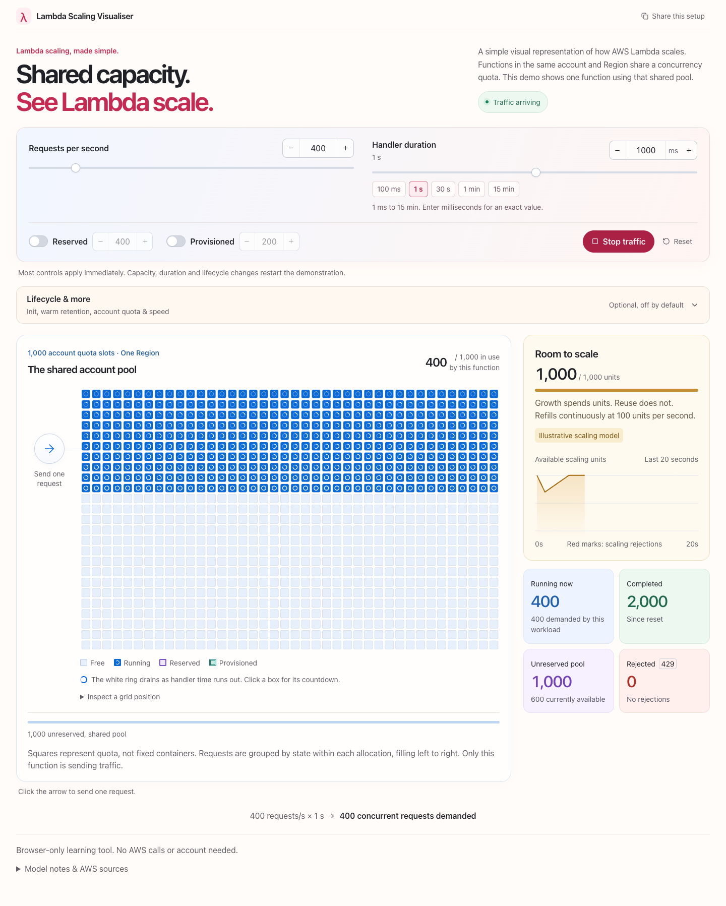

# Lambda Scaling Visualiser

### [Try it live: manishh-13.github.io/lambda-scaling-visualiser](https://manishh-13.github.io/lambda-scaling-visualiser/)

No install, no sign in, no AWS account needed. It runs entirely in your browser.

A simple visual representation of how AWS Lambda scales. Functions share an account concurrency quota within each Region. Send traffic to one function and see how it uses that shared capacity.

A minimal, browser-only teaching tool with a 1,000-slot account view, immediate controls, a single-request arrow, and a live scaling-capacity chart. No AWS calls, backend, authentication, or analytics.

[](https://manishh-13.github.io/lambda-scaling-visualiser/)

## Run locally

Requires Node.js 22.12 or later and npm.

```bash
npm ci
npm run dev
```

Open the URL Vite prints. The default base path is `/lambda-scaling-visualiser/`.

```bash
npm test
npm run typecheck
npm run build
npm run preview -- --host 127.0.0.1 --port 4322 --strictPort
```

The application is not deployed by this repository alone. The GitHub Pages workflow can publish it after you create a repository and enable Pages.

## The simple screen

- **Send one request:** the arrow invokes once, without starting continuous traffic.
- **Start traffic:** arrivals begin at your selected requests per second. Stop halts new arrivals; existing requests still finish. A returning 429 animation shows rejections without drawing every rejected request. Pause freezes the animation and reduced-motion settings keep the message static.
- **Handler duration:** the slider covers 1 ms to 15 minutes, with more space for short handlers. Quick choices include 30 seconds, 1 minute and 15 minutes. The numeric field accepts exact milliseconds up to 900,000. This is simulated handler time, not a timeout control.
- **Immediate controls:** rate and speed changes apply live. Duration, quota, allocation, and lifecycle changes automatically restart the demonstration using the new values. There is no Apply or Save button. Typed account quotas apply on Enter or when you leave the field, so incomplete digits cannot shrink your reservations.
- **Example account quota:** type any whole number from 100 to 10,000, including values such as 1,234. Enter or leaving the field applies it, Escape cancels the draft, and the plus/minus buttons still adjust by 100.
- **Reserved concurrency:** violet borders show capacity assigned to this function. Slots outside that reservation remain visible but are unavailable to this function.
- **Provisioned concurrency:** teal, double-bordered slots show prepared capacity. If PC is inside RC, it is not subtracted from the account a second time.
- **Free and warm:** free quota slots are pale blue. Optional warm environments are distinctly ochre with a diamond. The light interface uses coral, blue, mint and warm amber accents, with larger labels and bottom text.
- **Lifecycle & more:** directly above the simulation, with a visible summary of Init, warm retention, account quota and speed. Init and the warm retention window remain off by default. Open this section to enable them, pause/step, or try a scaling spike and short-duration high-volume traffic.
- **Watch capacity together:** Room to scale and its refill chart sit beside the concurrency grid on wide screens. The scaling column stays in view while inspecting the grid. Narrow screens place the scaling panel immediately above the grid.
- **Readable type:** 16 px equivalent body copy and inputs, 14 px equivalent secondary labels, in rem units so browser text settings and zoom still work.
- **Invocation countdown:** each running square has a white ring that drains as handler time runs out. Dense grids use a short time-left bar. Click a square, or use the keyboard-accessible grid-position inspector, for a larger ring and exact remaining time. These show real simulated handler time, not a decorative spinner; Pause freezes them, Step advances them, and speed changes the simulation clock.
- **Share this setup:** copies every setting, not playback progress. A selectable link appears if clipboard access is blocked.

Each square represents one unit of concurrency quota, not an environment that already exists. A finished request frees its visible slot. Reusable environments still exist underneath, so reuse does not repeatedly spend scaling capacity. The canvas creates no DOM node per slot. States are grouped from left to right inside each allocation to make changing concurrency easy to read. Grouping changes only presentation: it preserves every state/allocation count and never moves capacity across PC, RC or unreserved boundaries. State and remaining time are grouped together, so countdowns never become detached from the request currently displayed. The inspector describes a grid position, not a pinned environment identity; regrouping may put a different request in that position. Timing comes from the engine snapshot, excludes Init, resets on warm reuse, and disappears when the request finishes. No extra wall-clock or per-box animation timers are created.

## Allocation accounting

For an account quota Q, reserved concurrency R and provisioned concurrency P:

| Configuration | Function concurrency ceiling | Unreserved pool |
| --- | --- | --- |
| Neither enabled | Q | Q |
| RC only | R | Q - R |
| PC only | Q | Q - P |
| PC inside RC | R | Q - R |

The unreserved pool is an allocation. Its currently available portion also subtracts on-demand in-flight requests when the function is unreserved. PC occupies quota even when idle. Warm on-demand environments do not consume concurrency. Init does consume concurrency. At least 100 quota units must remain unreserved; PC cannot exceed RC when RC is configured.

## Simulation model and intentional shortcuts

The main app uses the tested discrete-event engine in `src/sim` through the worker runtime in `src/simple`. The original detailed UI modules remain in source as references and are not loaded by the simple screen. `docs/simple-ui-prototype.html` is the earlier design prototype, not the production simulation.

The worker advances fixed 50 ms outer steps while the engine processes arrivals and completions at exact sub-tick timestamps. A 20 ms handler lasts 20 simulated milliseconds. Frame rate does not change simulation arithmetic. Inactive tabs do not build an unlimited catch-up backlog. Idle timers and history buffers are bounded.

Teaching assumptions:

- All functions in an account and Region share its concurrency quota. This demo sends synchronous traffic to one function, with constant handler duration and no other functions using capacity.
- No retries, invocation errors, asynchronous queues, event sources, SnapStart, or extensions.
- The default example quota is 1,000, not a universal AWS starting quota. The UI maximum of 10,000 is a browser demonstration limit, not an AWS service limit.
- Provisioned capacity is shown READY immediately. This is a visualisation convenience, not a claim that real AWS allocation is instant. Published-version or alias targeting is assumed. Provisioned recycling and reset-related cold starts are omitted.
- Init is omitted by default. Enabling its illustrative duration adds an Init stage before a new on-demand environment runs the handler.
- With the warm retention window off, reusable environments persist invisibly until reset. With it on, completed environments show a warm state and are reclaimed after the chosen illustrative window. That window is not the configured function timeout, and AWS does not publish or guarantee how long an unused environment is kept.
- One shared scaling bucket begins at 1,000 units, refills continuously at 100 units/second, and never exceeds 1,000. Capacity expansion costs the larger of additional environments and additional synchronous RPS capacity divided by ten. Reuse within authorized capacity is free. There is no extra rolling ten-second gate.
- Account/function and provisioned RPS ceilings are aggregate limits, not a permanent ten-RPS cap per environment. The simulator smooths admission over 50 ms intervals. Manual clicks use that same capacity, not the configured rate slider as if it were a burst of clicks.
- AWS documents continuous best-effort scaling refill but does not publish its internal admission algorithm. This bucket is a deterministic educational approximation.

Throttle causes are simulator diagnoses, not CloudWatch dimensions. Precedence is request-rate ceiling, reserved concurrency, account concurrency, then scaling rate. Throttled requests never count as handler invocations or invocation errors.

## Tests and browser verification

`npm test` covers the legacy kernel, simple-mode additions, allocation arithmetic, bounded worker lifecycle, stable slot projection, configuration links and the React controls. UI tests simulate worker messages; real-browser tests separately exercise the production worker and rendered canvas.

With the production preview running, run `npm run test:browser`. Override `QA_URL` or `CHROME_PATH` if needed. The browser check uses a separate headless Chrome profile, never your logged-in browser tabs. It verifies manual invocation, live traffic, RC/PC colors and counts, top lifecycle controls, side-by-side scaling visibility, actual countdown progression and pause/step, shared settings, readable text, small viewports, reduced motion, accessibility, and console errors. Chrome is closed even when a check fails.

## GitHub Pages

The workflow in `.github/workflows/deploy-pages.yml` tests and builds, then deploys `dist` with official Pages actions. Enable GitHub Actions as the Pages source in repository settings. It runs manually and on pushes to `main`; remove the push trigger for manual-only deployment.

Override the base path for another repository name:

```bash
VITE_BASE_PATH=/renamed-repository/ npm run build
```

A private repository may need an eligible GitHub plan for Pages, and its Pages site can still be publicly reachable.

## AWS sources

- [Understanding Lambda function scaling](https://docs.aws.amazon.com/lambda/latest/dg/lambda-concurrency.html)
- [Lambda scaling behavior](https://docs.aws.amazon.com/lambda/latest/dg/burst-concurrency.html)
- [Lambda timeout limit](https://docs.aws.amazon.com/lambda/latest/dg/configuration-timeout.html)
- [Reserved concurrency](https://docs.aws.amazon.com/lambda/latest/dg/configuration-concurrency.html)
- [Provisioned concurrency](https://docs.aws.amazon.com/lambda/latest/dg/provisioned-concurrency.html)

Educational simulation only. Not affiliated with AWS. No AWS resources are created.
